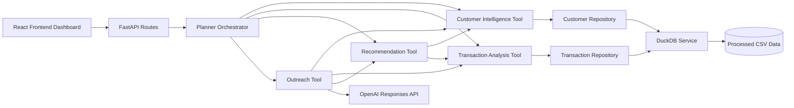
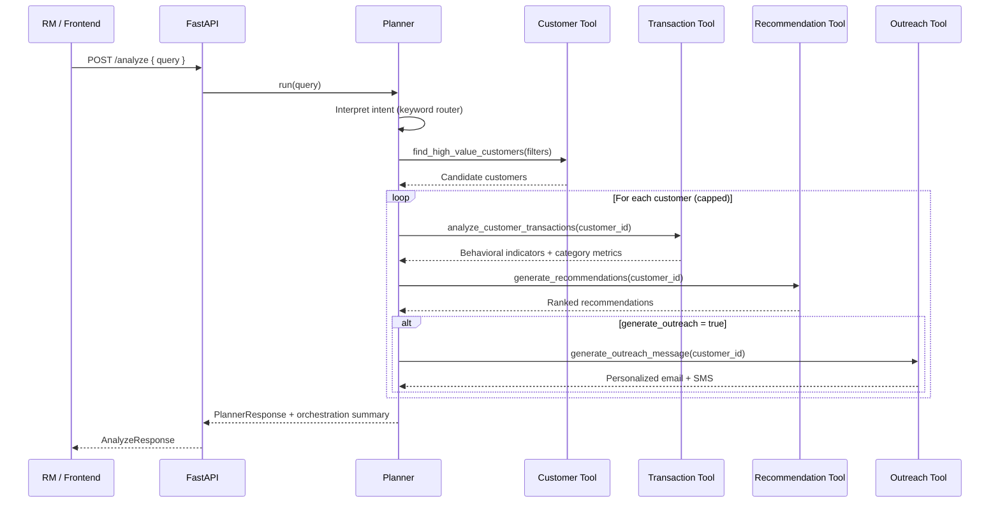
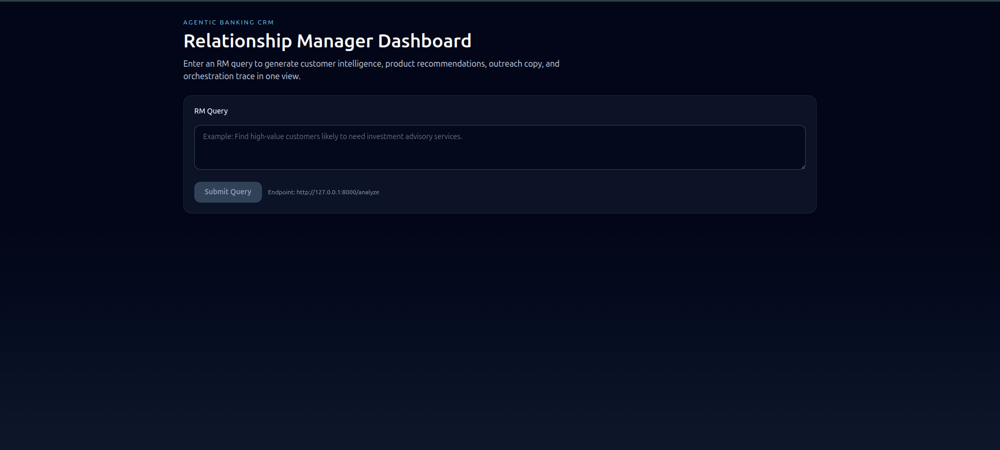
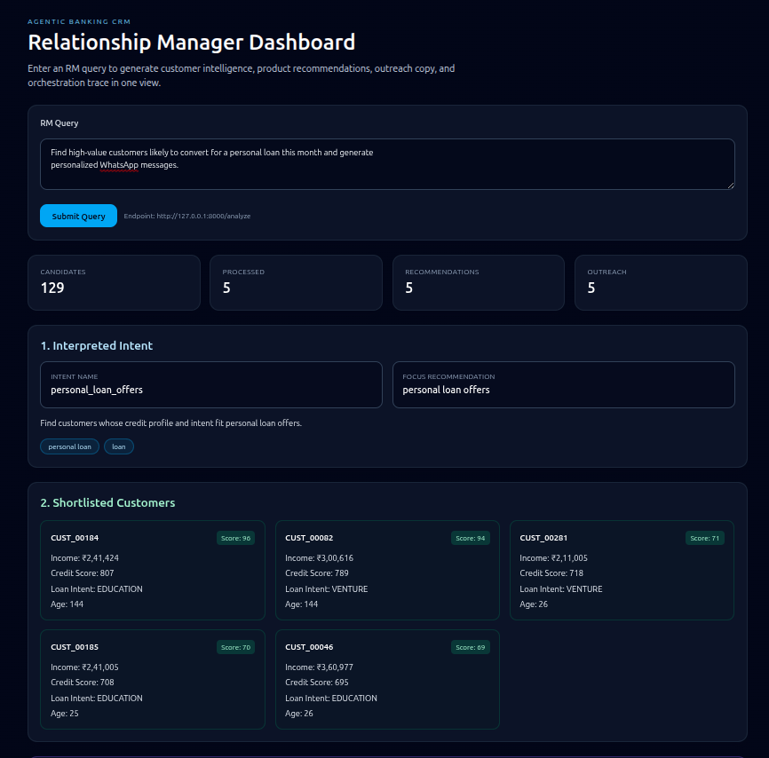
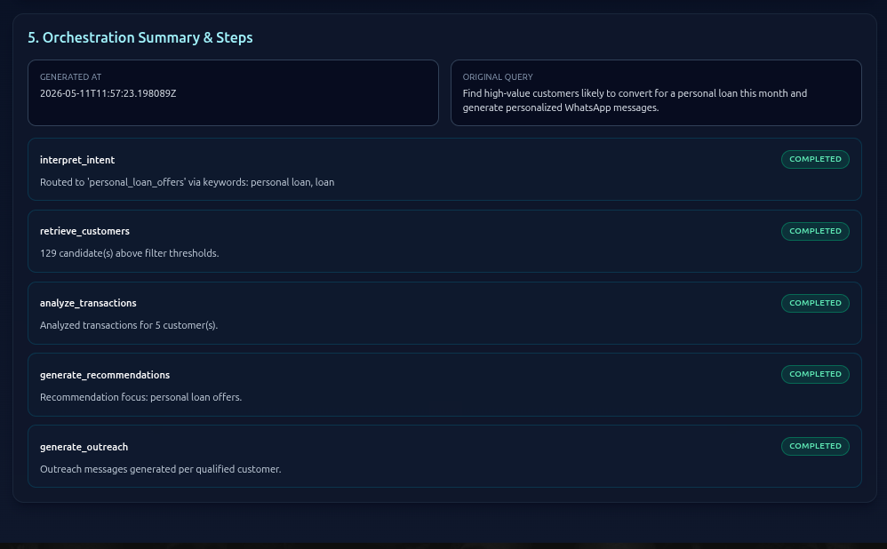

# Agentic Banking CRM

An end-to-end, agentic CRM system for banking relationship managers (RMs). The platform interprets free-form RM intent, identifies high-value customers, analyzes behavioral transaction signals, generates explainable product recommendations, and produces personalized outreach content through a modular multi-tool orchestration layer.

---

## 1) Project Overview

`Agentic Banking CRM` demonstrates how to combine deterministic business logic, lightweight intent interpretation, and LLM-assisted communication into one production-style workflow.  
The solution is split into cleanly separated backend layers (`API`, `orchestrator`, `tools`, `services`, `repositories`, `models`) plus a React frontend dashboard.

---

## 2) Objective of the Assignment

Build a modular agentic application that:
- Understands an RM's natural-language query.
- Maps intent to banking-specific targeting logic.
- Orchestrates customer intelligence, transaction analysis, recommendation scoring, and outreach generation.
- Returns a traceable, structured response suitable for both APIs and UI.

---

## 3) Features

- Intent-aware customer targeting via deterministic keyword planner.
- High-value customer discovery from DuckDB-backed analytics tables.
- Transaction behavior profiling (category mix + behavioral indicators).
- Explainable recommendation engine with confidence scores.
- AI-assisted outreach generation (email + SMS) with robust fallback when LLM is unavailable.
- Unified orchestration trace (step-wise metadata for observability and explainability).
- Frontend RM dashboard to run queries and inspect outputs in one screen.

---

## 4) Architecture Overview



### Separation of concerns
- `API`: request validation + response shaping.
- `Orchestrator`: only layer that composes multiple tools.
- `Tools`: domain logic with typed outputs.
- `Services`: infrastructure integrations (DuckDB).
- `Repositories`: query-level data access.
- `Frontend`: presentation and analyst workflow.

This separation makes the system highly extensible and easy to evolve without coupling UI, orchestration logic, and infrastructure.

---

## 5) Execution Flow

1. RM submits query from frontend (`POST /analyze`) or direct API call.
2. API forwards query to planner orchestrator.
3. Planner interprets intent and builds thresholds/focus strategy.
4. Customer tool fetches candidate profiles from DuckDB.
5. For each shortlisted customer:
   - Transaction tool computes spend metrics + behavioral indicators.
   - Recommendation tool scores ranked product opportunities.
   - Outreach tool generates personalized email/SMS (LLM or fallback).
6. Planner assembles final structured response + orchestration summary.
7. API returns normalized payload to frontend.

---

## 6) System Design Decisions

- **Typed contracts first**: Pydantic models ensure strict, explainable, and stable response shapes.
- **Deterministic planner routing**: first-match keyword rules keep intent mapping predictable and auditable.
- **Composable tool chain**: each tool solves one problem and can be reused independently.
- **Fail-safe AI usage**: outreach gracefully degrades to deterministic copy when API key/model is unavailable.
- **Traceability by design**: orchestration summary captures executed steps and status.

### Why DuckDB was chosen
- **Local OLAP performance** for analytical read-heavy workloads.
- **Zero external DB ops overhead** (single file, easy setup for assignment/demo).
- **Direct CSV ingestion** (`read_csv_auto`) aligns with provided processed datasets.
- **SQL + DataFrame ergonomics** supports both deterministic analytics and rapid iteration.
- **Portable and reproducible** for reviewer machines and demos.

---

## 7) Agentic Orchestration Flow



### Planner/orchestration design rationale
- The planner is the **single orchestrating authority**.
- Tools remain focused and side-effect-light.
- Intent and filtering logic stay centralized, making future intents easy to add (rule + plan factory).
- Per-customer processing cap controls latency and keeps responses predictable.


## Why This System Is Agentic
This system follows an agentic execution pattern rather than a single hardcoded workflow.
The planner dynamically:
- interprets RM intent,
- selects appropriate tools,
- orchestrates multi-step execution,
- maintains execution state,
- aggregates intermediate outputs,
- and produces explainable final responses.

Each tool is modular, independently executable, and coordinated through a centralized orchestration layer, enabling extensibility for future banking intelligence capabilities.

---

## 8) Tool Architecture

- `CustomerIntelligenceTool`  
  Retrieves high-value customer sets and profiles from processed customer data.

- `TransactionAnalysisTool`  
  Produces transaction aggregates, category spend shares, and behavioral flags (e.g., travel-heavy, high-spending).

- `RecommendationTool`  
  Combines customer profile + transaction behavior into confidence-scored, explainable recommendations.

- `OutreachTool`  
  Composes prior insights into personalized channel messages; uses OpenAI when available and fallback templates otherwise.

Because tools are isolated and typed, adding a new tool (e.g., churn risk scoring, next-best-action optimization) requires minimal changes outside planner wiring.

---

## 9) API Endpoints

Base URL (default): `http://127.0.0.1:8000`

- `GET /` - health check.
- `GET /high-value-customers` - returns top customers by default thresholds.
- `GET /customers/{customer_id}/transaction-analysis?top_categories=5` - transaction and behavior insights.
- `GET /customers/{customer_id}/recommendations` - recommendation list for one customer.
- `GET /customers/{customer_id}/outreach-message` - outreach copy for one customer.
- `GET /planner/run?query=...&max_customers=5&generate_outreach=true` - raw planner orchestration response.
- `POST /analyze` - consolidated API optimized for frontend consumption.

---

## 10) Frontend Overview

The frontend is a React + Vite dashboard focused on RM productivity:
- Query input for natural-language business requests.
- Visual sections for interpreted intent, shortlisted customers, recommendations, outreach, and execution trace.
- Metrics cards for candidate/process/recommendation/outreach counts.
- API-driven rendering using `VITE_API_BASE_URL`.

Path: `frontend/src/App.jsx`

---

## 11) Screenshots (Placeholders)

> Replace these with actual project screenshots.

### Dashboard Home


### Query + Results


### Recommendations & Outreach


### Orchestration Trace


---

## 12) Setup Instructions

### Prerequisites
- Python 3.11+ (recommended)
- Node.js 18+ and npm

### Backend setup

```bash
# from project root
python -m venv .venv
source .venv/bin/activate
pip install -r requirements.txt
```

### Run backend

```bash
uvicorn app.main:app --reload
```

### Frontend setup and run

```bash
cd frontend
npm install
npm run dev
```

Frontend default URL: `http://127.0.0.1:5173`

---

## 13) Environment Variables

Create `.env` in project root:

```bash
OPENAI_API_KEY=your_openai_api_key
```

Frontend optional variable:

```bash
VITE_API_BASE_URL=http://127.0.0.1:8000
```

Notes:
- `OPENAI_API_KEY` enables LLM-generated outreach.
- Without it, outreach still works via deterministic fallback messaging.

---

## 14) Example API Request / Response

### Request

```bash
curl -X POST "http://127.0.0.1:8000/analyze" \
  -H "Content-Type: application/json" \
  -d '{
    "query": "Find customers suitable for investment products with strong profile and spending signals"
  }'
```

### Response (trimmed)

```json
{
  "interpreted_intent": {
    "name": "investment_products",
    "description": "Match affluent, credit-worthy customers most suitable for investment products.",
    "matched_keywords": ["investment"],
    "focus_recommendation_type": "investment products",
    "required_behavioral_indicator": null
  },
  "shortlisted_customers": [
    {
      "customer_id": "CUST_001",
      "income": 120000.0,
      "credit_score": 780,
      "relationship_score": 84.5
    }
  ],
  "recommendations": [
    {
      "customer_id": "CUST_001",
      "recommendations": [
        {
          "recommendation_type": "investment products",
          "confidence_score": 0.87,
          "recommendation_reason": "High relationship strength and strong profile suggest investment suitability."
        }
      ]
    }
  ],
  "outreach_messages": [
    {
      "customer_id": "CUST_001",
      "personalized_email": "...",
      "sms_message": "...",
      "outreach_summary": "..."
    }
  ],
  "orchestration_summary": {
    "candidates_retrieved": 10,
    "customers_processed": 5,
    "recommendations_generated": 9,
    "outreach_messages_generated": 5,
    "steps": [
      {"name": "interpret_intent", "status": "completed"},
      {"name": "retrieve_customers", "status": "completed"}
    ]
  }
}
```

---

## 15) Trade-offs and Limitations

- Intent interpretation is keyword-rule based (deterministic but not semantically deep).
- Recommendation scoring uses transparent heuristics (fast and explainable, but not ML-optimized).
- Outreach quality depends on LLM availability and prompt quality.
- Current data source is batch CSV -> DuckDB reload, not live streaming ingestion.
- Planner currently runs sequential per-customer enrichment (simpler control flow over maximum throughput).

---

## 16) Future Improvements

- Hybrid intent engine (keyword rules + embedding/LLM classifier).
- Model-driven recommendation ranking with offline evaluation metrics.
- Parallelized per-customer orchestration for lower latency at scale.
- Conversation memory and RM feedback loop for continuous recommendation tuning.
- Authentication, role-based access, and audit/event logging.
- Containerization + CI pipelines + cloud deployment blueprint.

---

## 17) Tech Stack

**Backend**
- Python
- FastAPI
- Pydantic
- DuckDB
- Pandas / NumPy
- OpenAI Python SDK

**Frontend**
- React
- Vite
- Tailwind CSS

---

## 18) Folder Structure

```text
agentic-banking-crm/
├── app/
│   ├── api/                # FastAPI routes
│   ├── orchestrator/       # Planner orchestration layer
│   ├── tools/              # Domain tools (customer, transaction, recommendation, outreach)
│   ├── repositories/       # Data access/query logic
│   ├── services/           # Infrastructure services (DuckDB)
│   ├── models/             # Pydantic contracts
│   ├── prompts/            # LLM prompt templates
│   └── main.py             # FastAPI app entrypoint
├── data/
│   ├── processed/          # Source CSV datasets
│   └── banking_crm.duckdb  # Local analytics database (generated)
├── frontend/
│   └── src/                # React UI
├── requirements.txt
└── README.md
```

---

## 19) Demo Walkthrough

1. Start backend and frontend.
2. Open dashboard in browser.
3. Submit an RM query such as:
   - "Find high-value customers for premium cards"
   - "Identify travel-heavy customers for rewards card outreach"
4. Review:
   - interpreted intent,
   - shortlisted customer profiles,
   - recommendation confidence/reasons,
   - generated outreach messages,
   - orchestration summary with step trace.
5. Repeat with different query intents to demonstrate modular orchestration behavior.

---

## Extensibility Highlights

- Add new intent: create plan factory + keyword rule in planner.
- Add new tool: implement typed tool + wire into planner steps.
- Swap storage: replace `DuckDBService` and repositories with minimal impact to API/UI.
- Evolve UI independently because API responses are versioned by typed models.

This modular design keeps the project interview-friendly, production-minded, and easy to scale.
